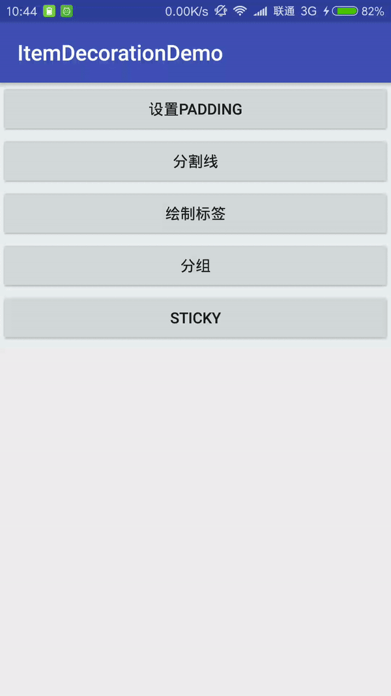

# ItemDecoration练习 #

## 设置padding ##

    private class PaddingDecoration extends RecyclerView.ItemDecoration{

        @Override
        public void getItemOffsets(Rect outRect, View view, RecyclerView parent, RecyclerView.State state) {
            super.getItemOffsets(outRect, view, parent, state);
			//相当于设置底部padding
            outRect.bottom = 30;
        }
    }

## 分割线 ##

实现思路:	要实现分割线效果需要 getItemOffsets()和 onDraw()2个方法，首先用 getItemOffsets给item下方空出一定高度的空间，然后用onDraw绘制这个空间

    private class DividerDecoration extends RecyclerView.ItemDecoration{

        private Paint dividerPaint;

        public DividerDecoration() {
            dividerPaint = new Paint();
            dividerPaint.setColor(Color.RED);
            dividerPaint.setStyle(Paint.Style.FILL);
        }

        @Override
        public void getItemOffsets(Rect outRect, View view, RecyclerView parent, RecyclerView.State state) {
            super.getItemOffsets(outRect, view, parent, state);
            outRect.bottom = 3;
        }

        @Override
        public void onDraw(Canvas c, RecyclerView parent, RecyclerView.State state) {
            super.onDraw(c, parent, state);
            for (int i=0;i<parent.getChildCount();i++){
                View view = parent.getChildAt(i);
                Rect rect = new Rect(parent.getPaddingLeft(), view.getBottom(), parent.getRight() - parent.getPaddingRight(), view.getBottom() + 3);
                c.drawRect(rect,dividerPaint);
            }
        }
    }

## 绘制标签 ##

    private class LabelDecoration extends RecyclerView.ItemDecoration {

        private Paint dividerPaint;

        public LabelDecoration() {
            dividerPaint = new Paint();
            dividerPaint.setColor(Color.RED);
            dividerPaint.setStyle(Paint.Style.FILL);
        }

        @Override
        public void onDrawOver(Canvas c, RecyclerView parent, RecyclerView.State state) {
            super.onDrawOver(c, parent, state);
            int gap = (int) TypedValue.applyDimension(TypedValue.COMPLEX_UNIT_DIP, 18, LabelActivity.this.getResources().getDisplayMetrics());
            int childCount = parent.getChildCount();
            //childcount为当前绘制出的item个数
            Log.d(TAG, "childCount=" + childCount);
            for (int i = 0; i < childCount; i++) {
                View view = parent.getChildAt(i);
                //获取控件在数据集合中的位置,不然标签滑动的时间会一直跳
                int position = parent.getChildAdapterPosition(view);
                if (position % 2 == 0) {
                    Rect rect = new Rect(0, view.getTop(), 0 + gap, view.getBottom());
                    dividerPaint.setColor(Color.BLUE);
                    c.drawRect(rect, dividerPaint);
                } else {
                    Rect rect = new Rect(parent.getRight() - gap, view.getTop(), parent.getRight(), view.getBottom());
                    dividerPaint.setColor(Color.RED);
                    c.drawRect(rect, dividerPaint);
                }
            }
        }
    }

组合效果:

    rv.addItemDecoration(new LabelDecoration());
    rv.addItemDecoration(new DividerDecoration());

## 分组 ##

先定义接口获取组id和首字母

    /**
     * 分组的回调接口
     */
    public interface GroupCallback {

        /**
         * 根据位置获取组id
         *
         * @param position
         * @return
         */
        long getGroupId(int position);

        /**
         * 根据位置获取组名称
         *
         * @param position
         * @return
         */
        String getGroupName(int position);

    }

核心代码:

    private class GroupDecoration extends RecyclerView.ItemDecoration {

        private GroupCallback groupCallback;
        private final Paint bgPaint;
        private final TextPaint mTextPaint;

        public GroupDecoration(GroupCallback groupCallback) {
            this.groupCallback = groupCallback;
            bgPaint = new Paint();
            bgPaint.setColor(Color.RED);
            bgPaint.setStyle(Paint.Style.FILL);
            mTextPaint = new TextPaint();
            mTextPaint.setColor(Color.WHITE);
            mTextPaint.setTextSize(54);
            mTextPaint.setTextAlign(Paint.Align.LEFT);
            mTextPaint.setTypeface(Typeface.DEFAULT_BOLD);
        }

        @Override
        public void getItemOffsets(Rect outRect, View view, RecyclerView parent, RecyclerView.State state) {
            super.getItemOffsets(outRect, view, parent, state);
            int position = parent.getChildAdapterPosition(view);
            if (position == 0 || groupCallback.getGroupId(position) != groupCallback.getGroupId(position - 1)) {
                //如果是第一个item,获取是一组中的第一个条目--?绘制间隔
                outRect.top = 90;
            }
        }

        @Override
        public void onDraw(Canvas c, RecyclerView parent, RecyclerView.State state) {
            super.onDraw(c, parent, state);
            for (int i = 0; i < parent.getChildCount(); i++) {
                View view = parent.getChildAt(i);
                int position = parent.getChildAdapterPosition(view);
                if (position == 0 || groupCallback.getGroupId(position) != groupCallback.getGroupId(position - 1)) {
                    //如果是第一个item,获取是一组中的第一个条目--?绘制组名称
                    Rect rect = new Rect(parent.getPaddingLeft(), view.getTop() - 90, parent.getWidth() - parent.getPaddingRight(), view.getTop());
                    c.drawRect(rect, bgPaint);
                    c.drawText(groupCallback.getGroupName(position), view.getPaddingLeft(), view.getTop() - 18, mTextPaint);
                }
            }
        }
    }

使用:

	//让adapter实现分组的接口定义
    private class PadAdapter extends RecyclerView.Adapter<PadAdapter.MyHolder> implements GroupCallback {...}

	//添加section效果
	PadAdapter adapter = new PadAdapter();
    rv.setAdapter(adapter);
    rv.addItemDecoration(new GroupDecoration(adapter));

## Sticky ##

实现思路:	header不动是绘制在item内容之上的，需要重写onDrawOver()方法，其他地方和section实现一样

    private class StickyDecoration extends RecyclerView.ItemDecoration {

        private GroupCallback groupCallback;
        private final Paint bgPaint;
        private final TextPaint mTextPaint;

        public StickyDecoration(GroupCallback groupCallback) {
            this.groupCallback = groupCallback;
            bgPaint = new Paint();
            bgPaint.setColor(Color.RED);
            bgPaint.setStyle(Paint.Style.FILL);
            mTextPaint = new TextPaint();
            mTextPaint.setColor(Color.WHITE);
            mTextPaint.setTextSize(54);
            mTextPaint.setTextAlign(Paint.Align.LEFT);
            mTextPaint.setTypeface(Typeface.DEFAULT_BOLD);
        }

        @Override
        public void getItemOffsets(Rect outRect, View view, RecyclerView parent, RecyclerView.State state) {
            super.getItemOffsets(outRect, view, parent, state);
            int position = parent.getChildAdapterPosition(view);
            if (position == 0 || groupCallback.getGroupId(position) != groupCallback.getGroupId(position - 1)) {
                //如果是第一个item,获取是一组中的第一个条目--?绘制间隔
                outRect.top = 90;
            }
        }

        @Override
        public void onDrawOver(Canvas c, RecyclerView parent, RecyclerView.State state) {
            super.onDrawOver(c, parent, state);
            for (int i = 0; i < parent.getChildCount(); i++) {
                View view = parent.getChildAt(i);
                int position = parent.getChildAdapterPosition(view);
                if (i == 0 || groupCallback.getGroupId(position) != groupCallback.getGroupId(position - 1)) {
                    //如果是第一个可见的item,或者是一组中的第一个条目--?绘制组名称
                    int top = view.getTop() - 90;
                    //阈值判断--> 实现吸顶效果
                    top = Math.max(parent.getTop(),top);
                    if(groupCallback.getGroupId(position)!=groupCallback.getGroupId(position+1)&&view.getBottom()<90){
                        //组内最后一个item完全进入header-->跟随移动
                        top = view.getBottom() - 90;
                    }
                    int bottom = top+90;
                    Rect rect = new Rect(parent.getPaddingLeft(), top, parent.getWidth() - parent.getPaddingRight(), bottom);
                    c.drawRect(rect, bgPaint);
                    c.drawText(groupCallback.getGroupName(position), view.getPaddingLeft(), bottom - 18, mTextPaint);
                }
            }
        }
    }