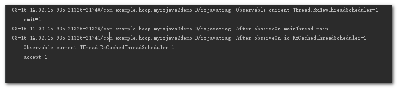

# 线程信息 #

    //打印出线程信息
        Observable.create(new ObservableOnSubscribe<Integer>() {
            @Override
            public void subscribe(ObservableEmitter<Integer> e) throws Exception {
                Log.d(TAG, "Observable current THread:" + Thread.currentThread().getName());
                Log.d(TAG, "emit=" + 1);
                e.onNext(1);
            }
        }).subscribe(new Consumer<Integer>() {
            @Override
            public void accept(Integer integer) throws Exception {
                Log.d(TAG, "Observable current THread:" + Thread.currentThread().getName());
                Log.d(TAG, "accept=" + integer);
            }
        });

日志打印:

tips:正常情况下, 上游和下游是工作在同一个线程中的, 也就是说上游在哪个线程发事件, 下游就在哪个线程接收事件.

# 线程调度 #

     //线程切换: 被观察者在子线程执行,观察者在主线程执行
        Observable.create(new ObservableOnSubscribe<Integer>() {
            @Override
            public void subscribe(ObservableEmitter<Integer> e) throws Exception {
                Log.d(TAG, "Observable current THread:" + Thread.currentThread().getName());
                Log.d(TAG, "emit=" + 1);
                e.onNext(1);
            }
        }).subscribeOn(Schedulers.newThread()).
                observeOn(AndroidSchedulers.mainThread()).
                subscribe(new Consumer<Integer>() {
                    @Override
                    public void accept(Integer integer) throws Exception {
                        Log.d(TAG, "Observable current THread:" + Thread.currentThread().getName());
                        Log.d(TAG, "accept=" + integer);
                    }
                });

日志打印:

tips:subscribeOn() 指定的是上游发送事件的线程, observeOn() 指定的是下游接收事件的线程.

# 多次切换线程 #

    //多次切换线程
        Observable.create(new ObservableOnSubscribe<Integer>() {
            @Override
            public void subscribe(ObservableEmitter<Integer> e) throws Exception {
                Log.d(TAG, "Observable current THread:" + Thread.currentThread().getName());
                Log.d(TAG, "emit=" + 1);
                e.onNext(1);
            }
        }).subscribeOn(Schedulers.newThread()).
                observeOn(AndroidSchedulers.mainThread()).
                doOnNext(new Consumer<Integer>() {
                    @Override
                    public void accept(Integer integer) throws Exception {
                        Log.d(TAG, "After observeOn mainThread:" + Thread.currentThread().getName());
                    }
                }).
                observeOn(Schedulers.io()).
                doOnNext(new Consumer<Integer>() {
                    @Override
                    public void accept(Integer integer) throws Exception {
                        Log.d(TAG, "After observeOn io:" + Thread.currentThread().getName());
                    }
                }).
                subscribe(new Consumer<Integer>() {
                    @Override
                    public void accept(Integer integer) throws Exception {
                        Log.d(TAG, "Observable current THread:" + Thread.currentThread().getName());
                        Log.d(TAG, "accept=" + integer);
                    }
                });

日志打印:

tips:

多次指定上游的线程只有第一次指定的有效, 也就是说多次调用subscribeOn() 只有第一次的有效, 其余的会被忽略.

多次指定下游的线程是可以的, 也就是说每调用一次observeOn() , 下游的线程就会切换一次.

# 网络请求 #

	//RxJava2 Adapter
    compile 'com.jakewharton.retrofit:retrofit2-rxjava2-adapter:1.0.0'

	public static Retrofit get() {
        OkHttpClient.Builder builder = new OkHttpClient().newBuilder();
        builder.readTimeout(10, TimeUnit.SECONDS);
        builder.connectTimeout(9, TimeUnit.SECONDS);

        return new Retrofit.Builder().baseUrl(ENDPOINT)
                .client(builder.build())
                .addConverterFactory(GsonConverterFactory.create())
                .addCallAdapterFactory(RxJava2CallAdapterFactory.create())
                .build();
    }

    /**
     * 查询运动类型
     * @return
     */
    @GET("api/venue/sporttype")
    Observable<Object> listSportType();
	
    Api api = RetrofitProvider.getLg().create(Api.class);
        api.listSportType()
                .subscribeOn(Schedulers.io())
                .observeOn(AndroidSchedulers.mainThread())
                .subscribe(new Observer<Object>() {
                    @Override
                    public void onSubscribe(Disposable d) {

                    }

                    @Override
                    public void onNext(Object value) {
                        Log.d(TAG, "onNext=" + value);
                    }

                    @Override
                    public void onError(Throwable e) {
                        Log.d(TAG, "onError=" + e.toString());
                    }

                    @Override
                    public void onComplete() {

                    }
                });