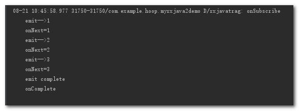

# 基本使用 #

    //Flowable的使用
        Flowable.create(new FlowableOnSubscribe<Integer>() {
            @Override
            public void subscribe(FlowableEmitter<Integer> e) throws Exception {
                Log.d(TAG, "emit-->1");
                e.onNext(1);
                Log.d(TAG, "emit-->2");
                e.onNext(2);
                Log.d(TAG, "emit-->3");
                e.onNext(3);
                Log.d(TAG, "emit complete");
                e.onComplete();
            }
        }, BackpressureStrategy.ERROR)
                .subscribe(new Subscriber<Integer>() {
                    @Override
                    public void onSubscribe(Subscription s) {
                        Log.d(TAG, "onSubscribe");
                        s.request(Long.MAX_VALUE);
                    }

                    @Override
                    public void onNext(Integer integer) {
                        Log.d(TAG, "onNext=" + integer);
                    }

                    @Override
                    public void onError(Throwable t) {
                        Log.d(TAG, "onError-->" + t);
                    }

                    @Override
                    public void onComplete() {
                        Log.d(TAG, "onComplete");
                    }
                });

日志打印:

tips:

1.创建Flowable的时候增加了一个参数, 这个参数是用来选择背压,也就是出现上下游流速不均衡的时候应该怎么处理的办法, 这里直接用BackpressureStrategy.ERROR这种方式, 这种方式会在出现上下游流速不均衡的时候直接抛出一个异常,这个异常就是MissingBackpressureException

2.下游的onSubscribe方法中传递的不再是Disposable了, 而是Subscription, 它们都是上下游中间的一个开关, 同样的调用Subscription.cancel()也可以切断水管, 不同的地方在于Subscription增加了一个void request(long n)方法

3.注释掉s.request(Long.MAX_VALUE);这句代码,会抛出异常

# 异步的情况 #

    Flowable.create(new FlowableOnSubscribe<Integer>() {
            @Override
            public void subscribe(FlowableEmitter<Integer> e) throws Exception {
                Log.d(TAG, "emit-->1");
                e.onNext(1);
                Log.d(TAG, "emit-->2");
                e.onNext(2);
                Log.d(TAG, "emit-->3");
                e.onNext(3);
                Log.d(TAG, "emit complete");
                e.onComplete();
            }
        }, BackpressureStrategy.ERROR)
                .subscribeOn(Schedulers.io())
                .observeOn(AndroidSchedulers.mainThread())
                .subscribe(new Subscriber<Integer>() {
                    @Override
                    public void onSubscribe(Subscription s) {
                        Log.d(TAG, "onSubscribe");
                        mSubscription = s;
                    }

                    @Override
                    public void onNext(Integer integer) {
                        Log.d(TAG, "onNext=" + integer);
                    }

                    @Override
                    public void onError(Throwable t) {
                        Log.w(TAG, "onError-->", t);
                    }

                    @Override
                    public void onComplete() {
                        Log.d(TAG, "onComplete");
                    }
                });

日志打印:

tips:

1.Flowable在设计的时候采用了一种新的思路也就是响应式拉取的方式来更好的解决上下游流速不均衡的问题

2.同步的情况下下游不去request会抛出异常,因为阻塞了线程;异步情况下不去request不会抛出异常,上游正常发射数据,由一个buffer来存储(最大128个事件),但下游不会收到任何事件.

