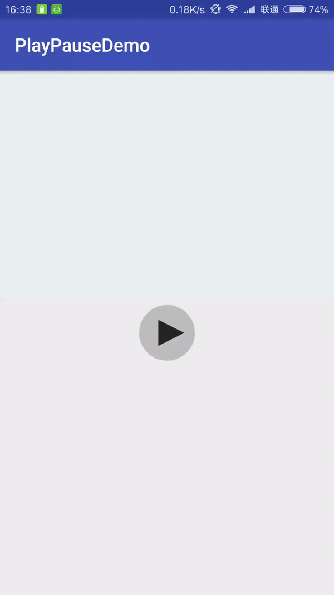
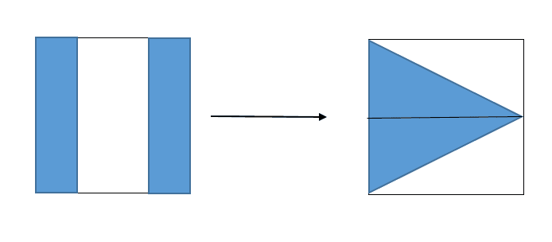

#参考

 github:    [播放暂停控件](https://github.com/Lauzy/PlayPauseView) 

# 播放暂停动画 #

目标效果:

#### 1.测量和初始化 ####

    public PlayPauseView(Context context, @Nullable AttributeSet attrs) {
        super(context, attrs);
        mBgPaint = new Paint();
        mBgPaint.setColor(0x33000000);
        mBgPaint.setAntiAlias(true);
        mBgPaint.setStyle(Paint.Style.FILL);
        mPathPaint = new Paint();
        mPathPaint.setColor(0xCC000000);
        mPathPaint.setAntiAlias(true);
        mPathPaint.setStyle(Paint.Style.FILL);
        mPath1 = new Path();
        mPath2 = new Path();
        setOnClickListener(this);
    }

    @Override
    protected void onMeasure(int widthMeasureSpec, int heightMeasureSpec) {
        super.onMeasure(widthMeasureSpec, heightMeasureSpec);
        mWidth = MeasureSpec.getSize(widthMeasureSpec);
        mHeight = MeasureSpec.getSize(heightMeasureSpec);
        switch (MeasureSpec.getMode(widthMeasureSpec)) {
            case MeasureSpec.EXACTLY:
                //取宽高较小值
                mWidth = mHeight = Math.min(mWidth, mHeight);
                break;
            default:
                //默认值
                mWidth = mHeight = (int) TypedValue.applyDimension(TypedValue.COMPLEX_UNIT_DIP, 60, getResources().getDisplayMetrics());
        }
        setMeasuredDimension(mWidth, mHeight);
    }

    @Override
    protected void onSizeChanged(int w, int h, int oldw, int oldh) {
        super.onSizeChanged(w, h, oldw, oldh);
        mRadius = mWidth / 2;
        mPadding = mRadius / 3;
        //中间正方形(有效绘制空间)边长
        mSide = (int) ((mRadius - mPadding) * Math.sqrt(2));
        //暂停符号的宽度
        mPauseWidth = mSide / 3;
    }

### 2.计算路径并绘制 ###

    @Override
    protected void onDraw(Canvas canvas) {
        super.onDraw(canvas);
        //绘制背景圆形
        canvas.drawCircle(mWidth / 2, mHeight / 2, mRadius, mBgPaint);
        //绘制辅助线
        /*Paint paint = new Paint();
        paint.setColor(Color.GREEN);
        paint.setStyle(Paint.Style.STROKE);
        Path path = new Path();
        path.moveTo(mRadius - mSide / 2 , mRadius - mSide / 2);
        path.lineTo(mRadius + mSide / 2, mRadius - mSide / 2);
        path.lineTo(mRadius + mSide / 2, mRadius + mSide / 2);
        path.lineTo(mRadius - mSide / 2, mRadius + mSide / 2);
        path.close();
        canvas.drawPath(path,paint);
        paint.setColor(Color.RED);
        canvas.drawCircle(mWidth/2,mHeight/2,mRadius*2/3,paint);*/
        int translate = (int) (mSide * mProgress/6);
        //左边暂停矩形路径,从左上角开始顺时针绘制
        mPath1.reset();
        mPath1.moveTo(mRadius - mSide / 2 + mSide / 2 * mProgress, mRadius - mSide / 2);
        mPath1.lineTo(mRadius - mSide / 6 + mSide / 6 * mProgress, mRadius - mSide / 2);
        mPath1.lineTo(mRadius - mSide / 6 + mSide / 6 * mProgress, mRadius + mSide / 2);
        mPath1.lineTo(mRadius - mSide / 2, mRadius + mSide / 2);
        mPath1.close();
        //右边暂停矩形路径,从左上角开始顺时针绘制
        mPath2.reset();
        mPath2.moveTo(mRadius + mSide / 6 - mSide / 6 * mProgress, mRadius - mSide / 2);
        mPath2.lineTo(mRadius + mSide / 2 - mSide / 2 * mProgress, mRadius - mSide / 2);
        mPath2.lineTo(mRadius + mSide / 2, mRadius + mSide / 2);
        mPath2.lineTo(mRadius + mSide / 6 - mSide / 6 * mProgress, mRadius + mSide / 2);
        mPath2.close();
        //旋转画布
        canvas.translate(translate, 0);
        canvas.rotate(90 * mProgress, mWidth / 2, mHeight / 2);
        //绘制暂停符号
        canvas.drawPath(mPath1, mPathPaint);
        canvas.drawPath(mPath2, mPathPaint);
    }

### 3.点击事件和动画实现 ###

	@Override
    public void onClick(View view) {
        if (isPlaying) {
            //正在播放-->暂停
            ValueAnimator valueAnimator = ValueAnimator.ofFloat(0, 1);
            valueAnimator.setDuration(400);
            valueAnimator.addUpdateListener(this);
            valueAnimator.start();
        } else {
            //暂停-->播放
            ValueAnimator valueAnimator = ValueAnimator.ofFloat(1, 0);
            valueAnimator.setDuration(400);
            valueAnimator.addUpdateListener(this);
            valueAnimator.start();
        }
        isPlaying = !isPlaying;
    }

    @Override
    public void onAnimationUpdate(ValueAnimator valueAnimator) {
        mProgress = (float) valueAnimator.getAnimatedValue();
        Log.d(TAG, "progress=" + mProgress);
        invalidate();
    }