# 参考 #
项目地址:	[https://github.com/nanchen2251/RxJava2Examples](https://github.com/nanchen2251/RxJava2Examples)

博客地址:	[https://www.jianshu.com/p/0cd258eecf60](https://www.jianshu.com/p/0cd258eecf60)

# create #

用户获取一个被观察的对象

    Observable.create(new ObservableOnSubscribe<Integer>() { // 第一步：初始化Observable
            @Override
            public void subscribe(@NonNull ObservableEmitter<Integer> e) throws Exception {
                Log.e(TAG, "Observable emit 1" + "\n");
                e.onNext(1);
                Log.e(TAG, "Observable emit 2" + "\n");
                e.onNext(2);
                Log.e(TAG, "Observable emit 3" + "\n");
                e.onNext(3);
                e.onComplete();
                Log.e(TAG, "Observable emit 4" + "\n" );
                e.onNext(4);
            }
        }).subscribe(new Observer<Integer>() { // 第三步：订阅

            // 第二步：初始化Observer
            private int i;
            private Disposable mDisposable;

            @Override
            public void onSubscribe(@NonNull Disposable d) {      
                mDisposable = d;
				Log.e(TAG, "onSubscribe : " + d.isDisposed() + "\n" );
            }

            @Override
            public void onNext(@NonNull Integer integer) {
                i++;
				Log.e(TAG, "onNext : value : " + integer + "\n" );
                if (i == 2) {
                    // 在RxJava 2.x 中，新增的Disposable可以做到切断的操作，让Observer观察者不再接收上游事件
                    mDisposable.dispose();
					Log.e(TAG, "onNext : isDisposable : " + mDisposable.isDisposed() + "\n");
                }
            }

            @Override
            public void onError(@NonNull Throwable e) {
                Log.e(TAG, "onError : value : " + e.getMessage() + "\n" );
            }

            @Override
            public void onComplete() {
                Log.e(TAG, "onComplete" + "\n" );
            }
        });

日志打印:

tips:

1.在发射了数值 3 之后，直接调用了 e.onComlete()，虽然无法接收事件，但发送事件还是继续的

# map #

对上游发送的每一个事件应用一个函数，使得每一个事件都按照指定的函数去变化

    Observable.create(new ObservableOnSubscribe<Integer>() {
            @Override
            public void subscribe(@NonNull ObservableEmitter<Integer> e) throws Exception {
                e.onNext(1);
                e.onNext(2);
                e.onNext(3);
            }
        }).map(new Function<Integer, String>() {
            @Override
            public String apply(@NonNull Integer integer) throws Exception {
                return "This is result " + integer;
            }
        }).subscribe(new Consumer<String>() {
            @Override
            public void accept(@NonNull String s) throws Exception {
                Log.e(TAG, "accept : " + s +"\n" );
            }
        });

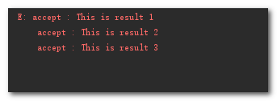

# concat #

1.连接操作符，可接受Observable的可变参数，或者Observable的集合

2.可以做到不交错的发射两个甚至多个 Observable 的发射事件，并且只有前一个 Observable 终止(onComplete) 后才会订阅下一个 Observable。

    Observable.concat(Observable.just(1,2,3), Observable.just(4,5,6))
                .subscribe(new Consumer<Integer>() {
                    @Override
                    public void accept(@NonNull Integer integer) throws Exception {
                        Log.e(TAG, "concat : "+ integer + "\n" );
                    }
                });

# zip #

合并事件专用," 分别从两个上游事件中各取出一个组合," 一个事件只能被使用一次，顺序严格按照事件发送的顺序,最终下游事件收到的是和上游事件最少的数目相同（必须两两配对，多余的舍弃)

    @Override
    protected void doSomething() {
        Observable.zip(getStringObservable(), getIntegerObservable(), new BiFunction<String, Integer, String>() {
            @Override
            public String apply(@NonNull String s, @NonNull Integer integer) throws Exception {
                return s + integer;
            }
        }).subscribe(new Consumer<String>() {
            @Override
            public void accept(@NonNull String s) throws Exception {
                Log.e(TAG, "zip : accept : " + s + "\n");
            }
        });

    }

    private Observable<String> getStringObservable() {
        return Observable.create(new ObservableOnSubscribe<String>() {
            @Override
            public void subscribe(@NonNull ObservableEmitter<String> e) throws Exception {
                if (!e.isDisposed()) {
                    e.onNext("A");
                    Log.e(TAG, "String emit : A \n");
                    e.onNext("B");
                    Log.e(TAG, "String emit : B \n");
                    e.onNext("C");
                    Log.e(TAG, "String emit : C \n");
                }
            }
        });
    }

    private Observable<Integer> getIntegerObservable() {
        return Observable.create(new ObservableOnSubscribe<Integer>() {
            @Override
            public void subscribe(@NonNull ObservableEmitter<Integer> e) throws Exception {
                if (!e.isDisposed()) {
                    e.onNext(1);
                    Log.e(TAG, "Integer emit : 1 \n");
                    e.onNext(2);
                    Log.e(TAG, "Integer emit : 2 \n");
                    e.onNext(3);
                    Log.e(TAG, "Integer emit : 3 \n");
                    e.onNext(4);
                    Log.e(TAG, "Integer emit : 4 \n");
                    e.onNext(5);
                    Log.e(TAG, "Integer emit : 5 \n");
                }
            }
        });
    }

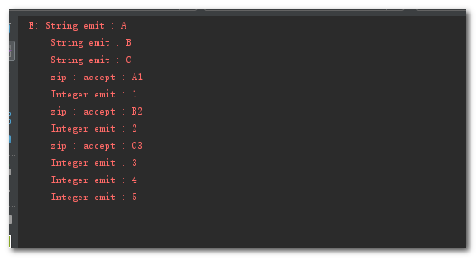

# flatmap #

将一个发送事件的上游Observable变换成多个发送事件的Observables， 然后将它们发射的时间合并后放进一个单独的Observable里

    Observable.create(new ObservableOnSubscribe<Integer>() {
            @Override
            public void subscribe(@NonNull ObservableEmitter<Integer> e) throws Exception {
                e.onNext(1);
                e.onNext(2);
                e.onNext(3);
            }
        }).flatMap(new Function<Integer, ObservableSource<String>>() {
            @Override
            public ObservableSource<String> apply(@NonNull Integer integer) throws Exception {
                List<String> list = new ArrayList<>();
                for (int i = 0; i < 3; i++) {
                    list.add("I am value " + integer);
                }
                int delayTime = (int) (1 + Math.random() * 10);
                return Observable.fromIterable(list).delay(delayTime, TimeUnit.MILLISECONDS);
            }
        }).subscribeOn(Schedulers.newThread())
                .observeOn(AndroidSchedulers.mainThread())
                .subscribe(new Consumer<String>() {
                    @Override
                    public void accept(@NonNull String s) throws Exception {
                        Log.e(TAG, "flatMap : accept : " + s + "\n");
                    }
                });

日志打印:

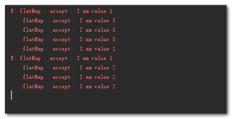

Tips:

1.flatMap 并不能保证事件的顺序

2.concatMap 与 FlatMap 的唯一区别就是 concatMap 保证了顺序

# distinct #

去重操作符

    Observable.just(1, 1, 1, 2, 2, 3, 4, 5)
                .distinct()
                .subscribe(new Consumer<Integer>() {
                    @Override
                    public void accept(@NonNull Integer integer) throws Exception {
                        Log.e(TAG, "distinct : " + integer + "\n");
                    }
                });

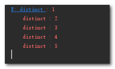

# buffer #

buffer(count, skip)，将 observable 中的数据按 skip（步长）分成最长不超过 count 的 buffer，然后生成一个 observable

    Observable.just(1, 2, 3, 4, 5)
                .buffer(3, 2)
                .subscribe(new Consumer<List<Integer>>() {
                    @Override
                    public void accept(@NonNull List<Integer> integers) throws Exception {
                        Log.e(TAG, "buffer size : " + integers.size() + "\n");
                        Log.e(TAG, "buffer value : " );
                        for (Integer i : integers) {
                            Log.e(TAG, i + "");
                        }
                        Log.e(TAG, "\n");
                    }
                });

日志打印:

# timer #

延迟执行一段逻辑

        Log.e(TAG, "timer start : " + TimeUtil.getNowStrTime() + "\n");
        Observable.timer(2, TimeUnit.SECONDS)
                .subscribeOn(Schedulers.io())
                .observeOn(AndroidSchedulers.mainThread())
                .subscribe(new Consumer<Long>() {
                    @Override
                    public void accept(@NonNull Long aLong) throws Exception {
                        Log.e(TAG, "timer :" + aLong + " at " + TimeUtil.getNowStrTime() + "\n");
                    }
                });

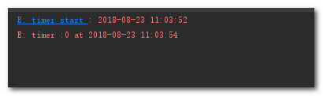

tips:

默认在新线程执行

# Interval #

1.间隔执行操作,默认在新线程

2.接受三个参数，分别是第一次发送延迟，间隔时间，时间单位

    @Override
    protected void doSomething() {
        Log.e(TAG, "interval start : " + TimeUtil.getNowStrTime() + "\n");
        mDisposable = Observable.interval(3, 2, TimeUnit.SECONDS)
                .subscribeOn(Schedulers.io())
                .observeOn(AndroidSchedulers.mainThread()) // 由于interval默认在新线程，所以我们应该切回主线程
                .subscribe(new Consumer<Long>() {
                    @Override
                    public void accept(@NonNull Long aLong) throws Exception {
                        Log.e(TAG, "interval :" + aLong + " at " + TimeUtil.getNowStrTime() + "\n");
                    }
                });
    }

    @Override
    protected void onDestroy() {
        super.onDestroy();
        if (mDisposable != null && !mDisposable.isDisposed()) {
            mDisposable.dispose();
        }
    }

# doOnNext #

让订阅者在接收到数据前干点事情的操作符

    Observable.just(1, 2, 3, 4)
                .doOnNext(new Consumer<Integer>() {
                    @Override
                    public void accept(@NonNull Integer integer) throws Exception {
                        Log.e(TAG, "doOnNext 保存 " + integer + "成功" + "\n");
                    }
                }).subscribe(new Consumer<Integer>() {
            @Override
            public void accept(@NonNull Integer integer) throws Exception {
                Log.e(TAG, "doOnNext :" + integer + "\n");
            }
        });

日志打印:

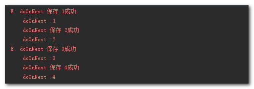

# skip #

接受一个long型参数，代表跳过多少个数目的事件再开始接收

    Observable.just(1,2,3,4,5)
                .skip(2)
                .subscribe(new Consumer<Integer>() {
                    @Override
                    public void accept(@NonNull Integer integer) throws Exception {
                        Log.e(TAG, "skip : "+integer + "\n");
                    }
                });

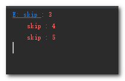

# take #

接受一个 long 型参数 count ，代表至多接收 count 个数据

    Flowable.fromArray(1,2,3,4,5)
                .take(2)
                .subscribe(new Consumer<Integer>() {
                    @Override
                    public void accept(@NonNull Integer integer) throws Exception {
                        Log.e(TAG, "accept: take : "+integer + "\n" );
                    }
                });

日志打印:

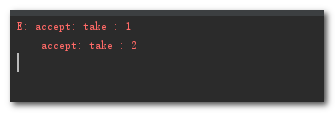

# just #

接受一个可变参数，依次发送

    Observable.just("1", "2", "3")
                .subscribeOn(Schedulers.io())
                .observeOn(AndroidSchedulers.mainThread())
                .subscribe(new Consumer<String>() {
                    @Override
                    public void accept(@NonNull String s) throws Exception {
                        mRxOperatorsText.append("accept : onNext : " + s + "\n");
                        Log.e(TAG,"accept : onNext : " + s + "\n" );
                    }
                });

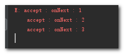

# Single #

Single 只会接收一个参数，而 SingleObserver 只会调用 onError() 或者 onSuccess()

    Single.just(new Random().nextInt())
                .subscribe(new SingleObserver<Integer>() {
                    @Override
                    public void onSubscribe(@NonNull Disposable d) {

                    }

                    @Override
                    public void onSuccess(@NonNull Integer integer) {
                        Log.e(TAG, "single : onSuccess : "+integer+"\n" );
                    }

                    @Override
                    public void onError(@NonNull Throwable e) {
                        Log.e(TAG, "single : onError : "+e.getMessage()+"\n");
                    }
                });

打印结果:

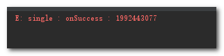

# debounce #

去除发送频率过快的项(去抖动)

    Observable.create(new ObservableOnSubscribe<Integer>() {
            @Override
            public void subscribe(@NonNull ObservableEmitter<Integer> emitter) throws Exception {
                // send events with simulated time wait
                emitter.onNext(1); // skip
                Thread.sleep(400);
                emitter.onNext(2); // deliver
                Thread.sleep(505);
                emitter.onNext(3); // skip
                Thread.sleep(100);
                emitter.onNext(4); // deliver
                Thread.sleep(605);
                emitter.onNext(5); // deliver
                Thread.sleep(510);
                emitter.onComplete();
            }
        }).debounce(500, TimeUnit.MILLISECONDS)
                .subscribeOn(Schedulers.io())
                .observeOn(AndroidSchedulers.mainThread())
                .subscribe(new Consumer<Integer>() {
                    @Override
                    public void accept(@NonNull Integer integer) throws Exception {
                        Log.e(TAG,"debounce :" + integer + "\n");
                    }
                });

# defer #

每次订阅都会创建一个新的 Observable，并且如果没有被订阅，就不会产生新的 Observable

    Observable<Integer> observable = Observable.defer(new Callable<ObservableSource<Integer>>() {
            @Override
            public ObservableSource<Integer> call() throws Exception {
                return Observable.just(1, 2, 3);
            }
        });

        observable.subscribe(new Observer<Integer>() {
            @Override
            public void onSubscribe(@NonNull Disposable d) {

            }

            @Override
            public void onNext(@NonNull Integer integer) {
                Log.e(TAG, "defer : " + integer + "\n");
            }

            @Override
            public void onError(@NonNull Throwable e) {
                Log.e(TAG, "defer : onError : " + e.getMessage() + "\n");
            }

            @Override
            public void onComplete() {
                Log.e(TAG, "defer : onComplete\n");
            }
        });

# last #

取出最后一个值，参数是没有值的时候的默认值

    Observable.just(1, 2, 3)
                .last(4)
                .subscribe(new Consumer<Integer>() {
                    @Override
                    public void accept(@NonNull Integer integer) throws Exception {
                        Log.e(TAG, "last : " + integer + "\n");
                    }
                });

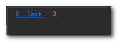

# merge #

将多个Observable合起来，接受可变参数，也支持使用迭代器集合

    Observable.merge(Observable.just(1, 2), Observable.just(3, 4, 5))
                .subscribe(new Consumer<Integer>() {
                    @Override
                    public void accept(@NonNull Integer integer) throws Exception {
                        Log.e(TAG, "accept: merge :" + integer + "\n" );
                    }
                });

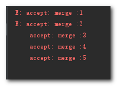

tips:

它和 concat 的区别在于，不用等到 发射器 A 发送完所有的事件再进行发射器 B 的发送

# reduce #

就是一次用一个方法处理一个值，可以有一个seed作为初始值

    Observable.just(1, 2, 3)
                .reduce(new BiFunction<Integer, Integer, Integer>() {
                    @Override
                    public Integer apply(@NonNull Integer integer, @NonNull Integer integer2) throws Exception {
                        return integer + integer2;
                    }
                }).subscribe(new Consumer<Integer>() {
            @Override
            public void accept(@NonNull Integer integer) throws Exception {
                Log.e(TAG, "accept: reduce : " + integer + "\n");
            }
        });

tips:

1 + 2 = 3 + 3 = 6

# scan #

和reduce差不多，区别在于reduce()只输出结果，而scan()会将过程中每一个结果输出

    Observable.just(1, 2, 3)
                .scan(new BiFunction<Integer, Integer, Integer>() {
                    @Override
                    public Integer apply(@NonNull Integer integer, @NonNull Integer integer2) throws Exception {
                        return integer + integer2;
                    }
                }).subscribe(new Consumer<Integer>() {
            @Override
            public void accept(@NonNull Integer integer) throws Exception {
                Log.e(TAG, "accept: scan " + integer + "\n");
            }
        });

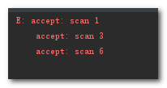

# window #

在时间间隔内缓存结果，类似于buffer缓存一个list集合，区别在于window将这个结果集合封装成了observable

    Log.e(TAG, "window\n");
        Observable.interval(1, TimeUnit.SECONDS) // 间隔一秒发一次
                .take(15) // 最多接收15个
                .window(3, TimeUnit.SECONDS)
                .subscribeOn(Schedulers.io())
                .observeOn(AndroidSchedulers.mainThread())
                .subscribe(new Consumer<Observable<Long>>() {
                    @Override
                    public void accept(@NonNull Observable<Long> longObservable) throws Exception {
                        Log.e(TAG, "Sub Divide begin...\n");
                        longObservable.subscribeOn(Schedulers.io())
                                .observeOn(AndroidSchedulers.mainThread())
                                .subscribe(new Consumer<Long>() {
                                    @Override
                                    public void accept(@NonNull Long aLong) throws Exception {
                                        Log.e(TAG, "Next:" + aLong + "\n");
                                    }
                                });
                    }
                });

日志打印:

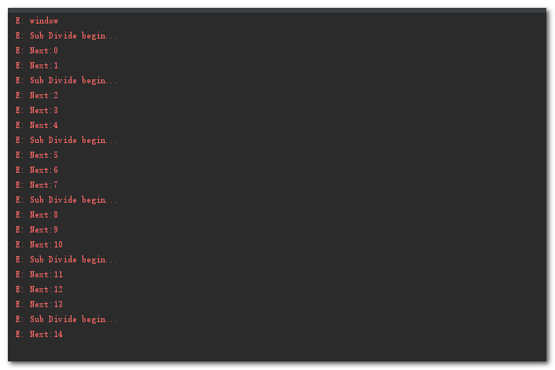

tips:interval发送的第一个item延时了1s