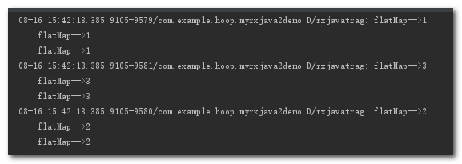

# Map变换 #

    Observable.create(new ObservableOnSubscribe<Integer>() {
            @Override
            public void subscribe(ObservableEmitter<Integer> e) throws Exception {
                e.onNext(1);
                e.onNext(2);
                e.onNext(3);
            }
        }).map(new Function<Integer, String>() {
            @Override
            public String apply(Integer integer) throws Exception {
                return "转换后的数据:" + integer;
            }
        }).subscribe(new Consumer<String>() {
            @Override
            public void accept(String s) throws Exception {
                Log.d(TAG, "accept=" + s);
            }
        });

日志打印:

tips:

map的作用就是对上游发送的每一个事件应用一个函数, 使得每一个事件都按照指定的函数去变化

# FlatMap #

    //flatmap函数
        Observable.create(new ObservableOnSubscribe<Integer>() {
            @Override
            public void subscribe(ObservableEmitter<Integer> e) throws Exception {
                e.onNext(1);
                e.onNext(2);
                e.onNext(3);
            }
        }).flatMap(new Function<Integer, ObservableSource<String>>() {
            @Override
            public ObservableSource<String> apply(Integer integer) throws Exception {
                ArrayList<String> list = new ArrayList<>();
                for (int i = 0; i < 3; i++) {
                    list.add("flatMap-->" + integer);
                }
                return Observable.fromIterable(list).delay(10, TimeUnit.MILLISECONDS);
            }
        }).subscribe(new Consumer<String>() {
            @Override
            public void accept(String s) throws Exception {
                Log.d(TAG, s);
            }
        });

tips:
1. 将一个发送事件的上游Observable变换为多个发送事件的Observables，然后将它们发射的事件合并后放进一个单独的Observable里.
2. flatMap并不保证事件的顺序,如果需要保证顺序则需要使用concatMap

# 实例 #

场景:一个嵌套的网络请求, 首先需要去请求注册, 待注册成功回调了再去请求登录的接口.

    api.register(new RegisterRequest())
                .subscribeOn(Schedulers.io())
                .observeOn(AndroidSchedulers.mainThread())
                .doOnNext(new Consumer<RegisterResponse>() {
                    @Override
                    public void accept(RegisterResponse registerResponse) throws Exception {
                        //根据注册的结果做相应操作
                    }
                })
                .observeOn(Schedulers.io())     //回到io线程做登录请求
                .flatMap(new Function<RegisterResponse, ObservableSource<LoginResponse>>() {
                    @Override
                    public ObservableSource<LoginResponse> apply(RegisterResponse registerResponse) throws Exception {
                        return api.login(new LoginRequest());
                    }
                })
                .observeOn(AndroidSchedulers.mainThread())
                .subscribe(new Consumer<LoginResponse>() {
                    @Override
                    public void accept(LoginResponse loginResponse) throws Exception {
                        //登录成功
                    }
                }, new Consumer<Throwable>() {
                    @Override
                    public void accept(Throwable throwable) throws Exception {
                        //登录失败
                    }
                });

