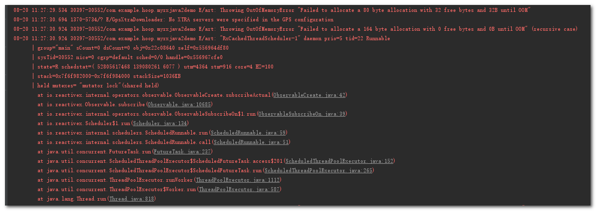

# 内存溢出 #

    Observable.create(new ObservableOnSubscribe<Integer>() {
            @Override
            public void subscribe(ObservableEmitter<Integer> e) throws Exception {
                int i = 0;
                while (true) {
                    Log.d(TAG, "emit-->" + i);
                    e.onNext(i);
                    i++;
                }
            }
        }).subscribeOn(Schedulers.io())
                .observeOn(AndroidSchedulers.mainThread())
                .subscribe(new Consumer<Integer>() {
                    @Override
                    public void accept(Integer integer) throws Exception {
                        Thread.sleep(500);
                        Log.d(TAG, "accept:" + integer);
                    }
                });

录屏效果:

	

错误日志:

tips:

当上下游工作在不同的线程中时, 这时候是一个异步的订阅关系, 这个时候上游发送数据不需要等待下游接收,  因为两个线程并不能直接进行通信, 因此上游发送的事件并不能直接到下游里去, 这个时候就需要一个水缸来帮助它们俩! 上游把事件发送到水缸里去, 下游从水缸里取出事件来处理, 因此, 当上游发事件的速度太快, 下游取事件的速度太慢, 水缸就会迅速装满, 然后溢出来, 最后就OOM了.

# 处理思路 #

1.减少数量()

	//过滤
    Observable.create(new ObservableOnSubscribe<Integer>() {
            @Override
            public void subscribe(ObservableEmitter<Integer> emitter) throws Exception {
                for (int i = 0; ; i++) {
                    emitter.onNext(i);
                }
            }
        }).subscribeOn(Schedulers.io())
                .filter(new Predicate<Integer>() {
                    @Override
                    public boolean test(Integer integer) throws Exception {
                        return integer % 10 == 0;
                    }
                })
                .observeOn(AndroidSchedulers.mainThread())
                .subscribe(new Consumer<Integer>() {
                    @Override
                    public void accept(Integer integer) throws Exception {
                        Log.d(TAG, "" + integer);
                    }
                });

	//采样
    Observable.create(new ObservableOnSubscribe<Integer>() {
            @Override
            public void subscribe(ObservableEmitter<Integer> emitter) throws Exception {
                for (int i = 0; ; i++) {
                    emitter.onNext(i);
                }
            }
        }).subscribeOn(Schedulers.io())
                .sample(2, TimeUnit.SECONDS)  //sample取样
                .observeOn(AndroidSchedulers.mainThread())
                .subscribe(new Consumer<Integer>() {
                    @Override
                    public void accept(Integer integer) throws Exception {
                        Log.d(TAG, "" + integer);
                    }
                });

缺点:丢失了大量事件

2.减速

	Observable.create(new ObservableOnSubscribe<Integer>() {
            @Override
            public void subscribe(ObservableEmitter<Integer> emitter) throws Exception {
                for (int i = 0; ; i++) {
                    emitter.onNext(i);
                    Thread.sleep(2000);  //每次发送完事件延时2秒
                }
            }
        }).subscribeOn(Schedulers.io())
                .observeOn(AndroidSchedulers.mainThread())
                .subscribe(new Consumer<Integer>() {
                    @Override
                    public void accept(Integer integer) throws Exception {
                        Log.d(TAG, "" + integer);
                    }
                });

