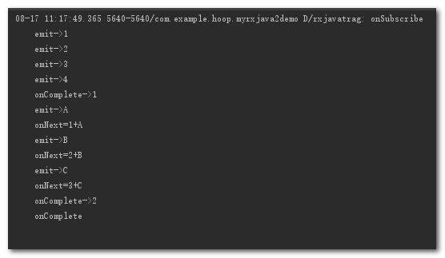

# zip #
    
    //zip函数的使用
        Observable<Integer> observable1 = Observable.create(new ObservableOnSubscribe<Integer>() {
            @Override
            public void subscribe(ObservableEmitter<Integer> e) throws Exception {
                Log.d(TAG, "emit->" + 1);
                e.onNext(1);
                Log.d(TAG, "emit->" + 2);
                e.onNext(2);
                Log.d(TAG, "emit->" + 3);
                e.onNext(3);
                Log.d(TAG, "emit->" + 4);
                e.onNext(4);
                Log.d(TAG, "onComplete->1");
                e.onComplete();
            }
        });
        Observable<String> observable2 = Observable.create(new ObservableOnSubscribe<String>() {
            @Override
            public void subscribe(ObservableEmitter<String> e) throws Exception {
                Log.d(TAG, "emit->A");
                e.onNext("A");
                Log.d(TAG, "emit->B");
                e.onNext("B");
                Log.d(TAG, "emit->C");
                e.onNext("C");
                Log.d(TAG, "onComplete->2");
                e.onComplete();
            }
        });
        Observable.zip(observable1, observable2, new BiFunction<Integer, String, String>() {
            @Override
            public String apply(Integer integer, String s) throws Exception {
                return integer + "+" + s;
            }
        }).subscribe(new Observer<String>() {
            @Override
            public void onSubscribe(Disposable d) {
                Log.d(TAG, "onSubscribe");
            }

            @Override
            public void onNext(String value) {
                Log.d(TAG, "onNext=" + value);
            }

            @Override
            public void onError(Throwable e) {
                Log.d(TAG, "onError");
            }

            @Override
            public void onComplete() {
                Log.d(TAG, "onComplete");
            }
        });

日志打印:

tips:

Zip通过一个函数将多个Observable发送的事件结合到一起，然后发送这些组合到一起的事件. 它按照严格的顺序应用这个函数。它只发射与发射数据项最少的那个Observable一样多的数据。

# 实例 #

场景:

一个界面需要展示用户的一些信息, 而这些信息分别要从两个服务器接口中获取, 而只有当两个都获取到了之后才能进行展示

    //多个请求的处理
        Api api = RetrofitProvider.get().create(Api.class);
        //用户基本信息
        Observable<UserBaseInfoResponse> observable1 = api.getUserBaseInfo(new UserBaseInfoRequest())
                .subscribeOn(Schedulers.io());
        //用户额外信息
        Observable<UserExtraInfoResponse> observable2 = api.getUserExtraInfo(new UserExtraInfoRequest()).subscribeOn(Schedulers.io());
        Observable.zip(observable1, observable2, new BiFunction<UserBaseInfoResponse, UserExtraInfoResponse, UserInfo>() {
            @Override
            public UserInfo apply(UserBaseInfoResponse userBaseInfoResponse, UserExtraInfoResponse userExtraInfoResponse) throws Exception {
                return new UserInfo(userBaseInfoResponse, userExtraInfoResponse);
            }
        }).observeOn(AndroidSchedulers.mainThread())
                .subscribe(new Consumer<UserInfo>() {
                    @Override
                    public void accept(UserInfo userInfo) throws Exception {
                        //拿到完整用户信息-->做对应操作
                    }
                });